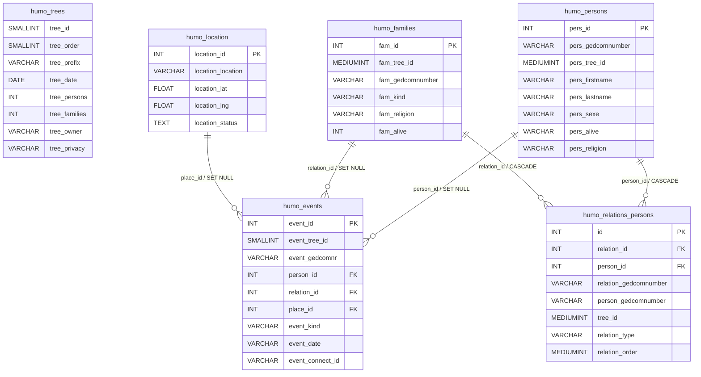
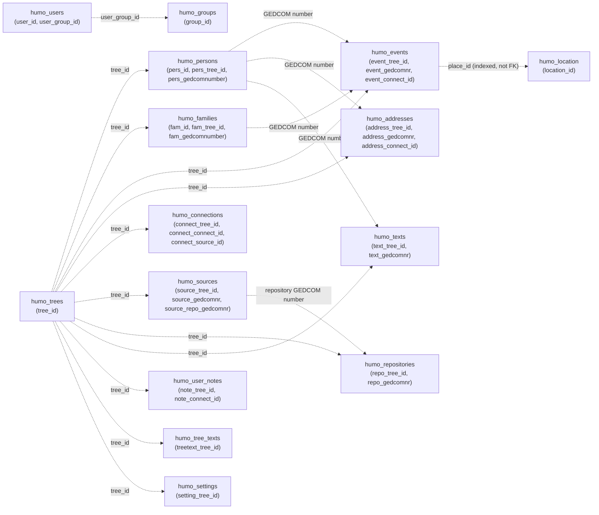

# Humogen database ERD

This document is a Mermaid-native entity relationship diagram derived from the supplied phpMyAdmin SQL dump for `khandesh21at_humogen`.

The solid relationships below are the five foreign keys declared in the dump. The schema also contains many logical relationships based on fields such as `*_tree_id`, `*_gedcomnr`, and `*_connect_id`; those are documented separately because MariaDB does not enforce them as foreign keys.

## Enforced relational core

## Logical genealogy and application links

These links are visible from column names and indexes, but are not declared as foreign keys in the dump. They are shown as logical associations rather than enforced constraints.

## Auxiliary, staging, survey, and reporting objects

The following objects are present in the dump but have no declared foreign-key constraints. Many are denormalized imports, temporary staging tables, materialized relationship outputs, or application-specific extensions.

```mermaid
flowchart TB
    CORE["Core genealogy tables"]
    STAGE["Import / staging"]
    LEGACY["Legacy or custom tables"]
    REPORT["Derived relationship/report tables"]
    SURVEY["Survey tables"]

    CORE --> STAGE
    CORE --> REPORT
    SURVEY --> REPORT

    STAGE --- P1["humo_persons_temp"]
    STAGE --- F1["humo_families_temp"]
    STAGE --- E1["humo_events_temp"]

    LEGACY --- B["bachelors2"]
    LEGACY --- I["Individuals"]
    LEGACY --- M["markers"]
    LEGACY --- MP["missingphone"]
    LEGACY --- SP["spouse"]
    LEGACY --- XD["xx_pers_details"]
    LEGACY --- EDU["Education"]

    SURVEY --- DS["x_datasurvey"]
    SURVEY --- SH["x_field_survey_hdr"]
    SURVEY --- SD["x_field_survey_dtl"]
    SURVEY --- SDD["x_field_survey_data"]

    REPORT --- VR["v_relatives / v_relatives_info"]
    REPORT --- VP["v_getphones_city / v_get_dob"]
    REPORT --- VF["v_father / v_mother / v_spouse"]
    REPORT --- VS["v_son / v_daughter / v_sister / v_brother"]
    REPORT --- VG["v_pat_* / v_mat_* / v_*_brother / v_*_sister"]
    REPORT --- VC["v_*_sp / v_*_son / v_*_daughter"]
```

### Interpretation notes

- `humo_events.person_id`, `humo_events.relation_id`, and `humo_events.place_id` are nullable and use `ON DELETE SET NULL`.
- `humo_relations_persons.person_id` and `humo_relations_persons.relation_id` use `ON DELETE CASCADE`.
- The `humo_trees` table has no primary-key declaration in the supplied dump, although `tree_id` is used throughout the schema as the tree discriminator.
- Tables prefixed `v_` are created as tables in this dump, not SQL views; their names indicate denormalized relationship outputs.
- Mermaid renders the code blocks directly in GitHub-compatible Markdown viewers and in applications that load Mermaid.js.

